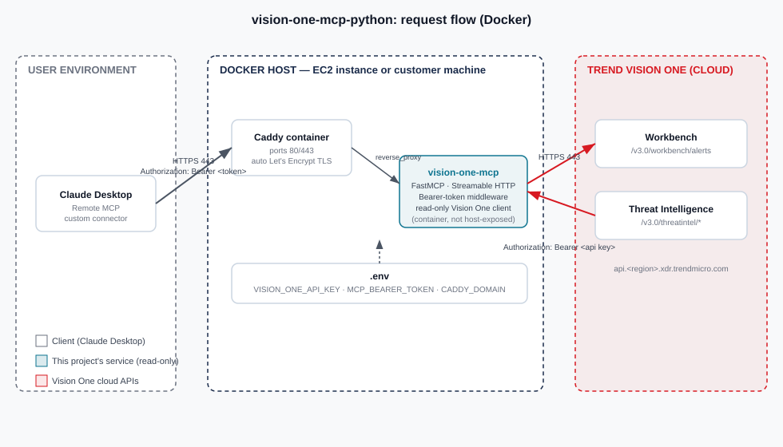

# Architecture

## Components

- **Claude Desktop** — connects as a remote MCP custom connector over HTTPS. Sends an
  `Authorization: Bearer <token>` header on every request; has no direct knowledge of
  Vision One at all, only of the tools this server exposes.
- **Ingress** — terminates TLS. Claude Desktop's custom connector will not accept a
  self-signed certificate, so this needs a certificate from a publicly trusted CA (see
  [`deploy/ec2/README.md`](../deploy/ec2/README.md) for the cert-manager/Let's Encrypt
  setup used for the AWS-hosted instance).
- **Service / Pod** — the actual `vision-one-mcp-python` container. Two layers inside:
  1. `BearerAuthMiddleware` (plain ASGI middleware, checked before anything else,
     `/healthz` excepted for kubelet probes) rejects any request that doesn't present
     the configured shared secret.
  2. `FastMCP` — registers the four read-only tools and speaks Streamable HTTP.
- **Secret / ConfigMap** — the Vision One API key, the MCP bearer token, and the
  region/base-URL config, injected as environment variables. Never baked into the image.
- **Trend Vision One** — the actual data source. The pod calls out to
  `api.<region>.xdr.trendmicro.com` with the Vision One API key as its own bearer token
  — a second, separate credential from the one Claude Desktop uses to talk to *this*
  server.

## Two independent trust boundaries

It's worth being explicit that there are two different bearer tokens doing two
different jobs, because it's easy to conflate them:

1. **Claude Desktop ↔ this server**: the `MCP_BEARER_TOKEN` you generate yourself and
   configure in both places. Proves to this server that a request is from *your*
   Claude Desktop, not a random client that found the URL.
2. **This server ↔ Trend Vision One**: the `VISION_ONE_API_KEY` from your Vision One
   tenant. Proves to Vision One that this server is allowed to read Workbench/Threat
   Intel data.

Compromising one does not automatically expose the other — but this server does hold
both secrets in memory, so the pod itself is the thing to lock down (least-privilege
API key permissions, `readOnlyRootFilesystem`, non-root user — all set in the Helm
chart's default `securityContext`).

## Why not Lambda / EventBridge / SNS here

An earlier direction for this project explored Vision One's S3-based SIEM export
combined with EventBridge, SNS, and Lambda for an event-driven ingestion pipeline.
That's still a reasonable design — for *that* problem. It doesn't fit *this* problem:
Claude Desktop's remote MCP transport needs a long-lived, addressable HTTP endpoint
that can hold a streaming connection open, which is a server model, not a
function-invocation model. Lambda's 15-minute execution cap and non-persistent nature
fight against that; a small always-on container (on Kubernetes, whether that's a k3s
node on EC2 or a customer's own cluster) is the natural fit instead.

## Read-only by design

There is no code path in this repository that can modify anything in Vision One. The
`VisionOneClient` in `src/vision_one_mcp/client.py` only implements GET requests. If
this project grows write/action tools later (isolating an endpoint, adding a
suspicious object), they should be added behind an explicit `readonly` flag, mirroring
the pattern the official [vision-one-mcp-server](https://github.com/trendmicro/vision-one-mcp-server)
uses.
